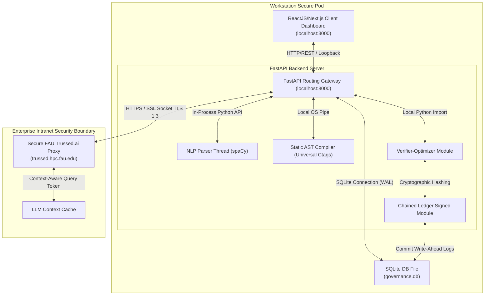
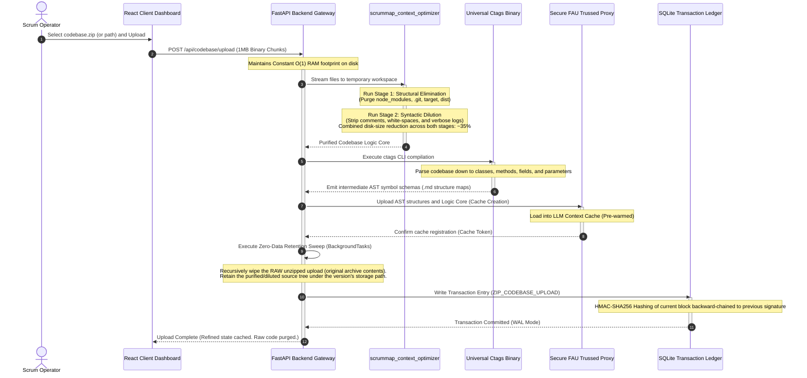
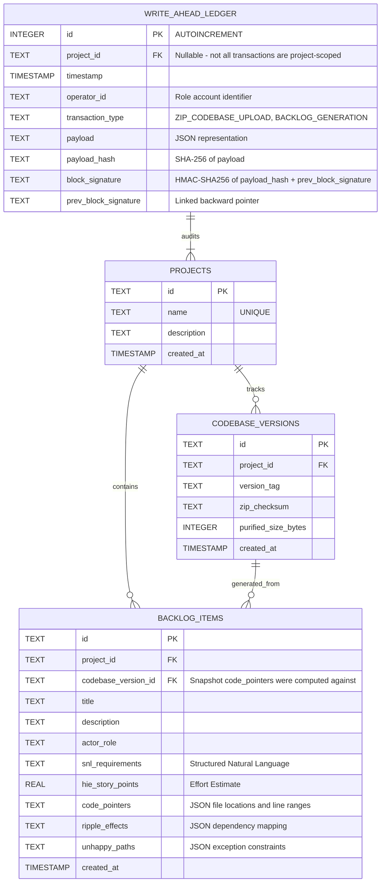
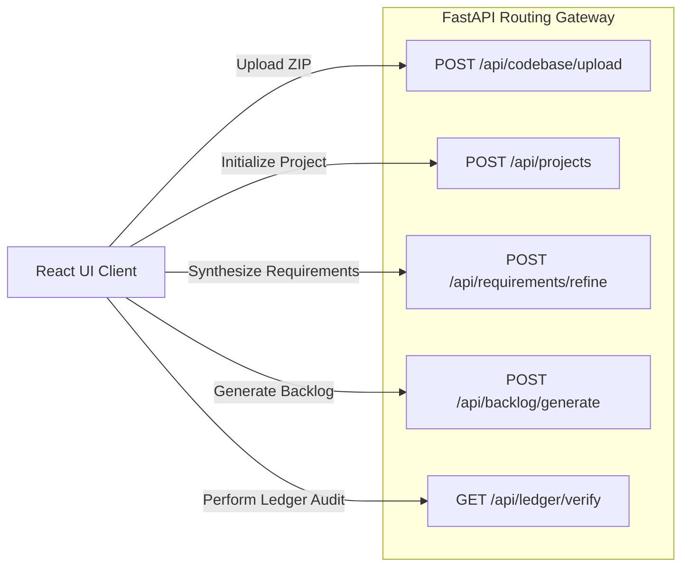
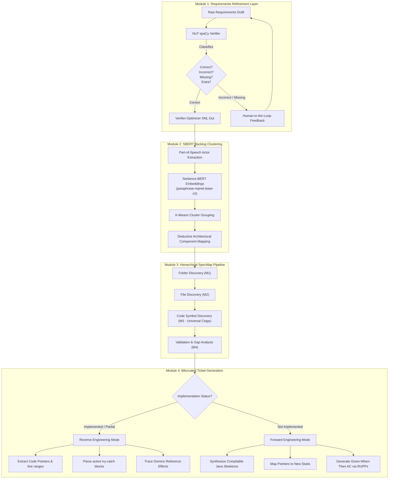

# ScrumMap: Comprehensive System Design & Technical Specifications

This document serves as the authoritative, technically exhaustive System Design Specification for **ScrumMap**. It outlines the localized single-workstation system topologies, programmatic data optimization pipelines, in-memory context caching strategies, relational database schemas, and developer-facing observability layers that realize a secure, air-gapped requirements-to-backlog synthesis tool.

---

## 1. The Visual Layer: Single-Page ReactJS & Next.js Dashboard

The client layer is engineered as a highly responsive, type-safe Single-Page Application (SPA) utilizing **ReactJS, Next.js, and TypeScript**. The layout is structured around a **sticky sidebar navigation panel** (managing system-wide navigational states) and a **dynamic central viewport** that updates asynchronously to prevent full-page refreshes.

### 1.1 UI Component Architecture & Stepper
The entry point of the interface centers on an operational **Deployment Stepper** that guides the user linearly through the automated backlog engineering lifecycle:
$$\text{Requirements Input} \longrightarrow \text{Purification \& Ingestion} \longrightarrow \text{Verifier-Optimizer Loop} \longrightarrow \text{UML Synthesis} \longrightarrow \text{Skeletal Code \& Backlog Export}$$

The central viewport is divided into **four core visualization tabs**, each mapped to specific backend REST schemas:

### 1.2 View 1: Dashboard & Ingestion Hub (Codebase Drop-Zone)
*   **Purpose**: The central control room for system initialization and codebase upload.
*   **Key Visual Elements**:
    *   **Drag-and-Drop File Container**: An interactive upload boundary restricted programmatically to `.zip` file packages (`<input type="file" accept=".zip" />`).
    *   **Absolute Directory Path Scanner**: A simple input text box enabling developers to provide direct host drive access (e.g., `/Users/username/workspace/target-repo`).
    *   **Streaming Progress Indicators**: Dynamic CSS-transitioned progress bars displaying real-time upload progress, file-size summaries, and pipeline state updates.
    *   **Operational Pipeline Stepper**: Visual step indicators reflecting the backend execution states: *Ingesting Stream*, *Structural Noise Purifying*, *AST Symbol Indexing*, *Context Caching*, and *Ledger Audit Registration*.
    *   **Role Picker Dropdown**: Selects which locally-configured role key (see `scrummap.env` §6) the client attaches as the `X-ScrumMap-Role-Key` header on subsequent requests. The backend derives the enforced role from the key itself, not from this dropdown selection, so switching roles here only changes which key the browser sends — it cannot be used to spoof a role without possessing that role's key.

### 1.3 View 2: Tab 1 — Technical Documentation (Interactive UML Canvas)
*   **Purpose**: Provides visual verification of the synthesized software architecture and structural layouts.
*   **Key Visual Elements**:
    *   **Interactive SVG Display Panel**: Integrates with the backend-driven PlantUML and Mermaid.js compilers to render interactive, high-resolution **UML Class Diagrams** and **Sequence Diagrams** natively within the browser.
    *   **Structural Class Navigator**: An expand-and-collapse tree list detailing extracted class entities, private attributes, base constructors, and lemmatized method operational blocks.
    *   **Message Interaction Sequence Trace**: An interactive list of dynamic messages, control loops, optional fragments, and lifeline activations mapping sequence diagram lifelines.
    *   **Model Consistency Audit Card**: A split-screen audit view displaying structural and behavioral models side by side, highlighting consistency warnings (such as classes lacking operations or sequence lifelines without matching type definitions) using specialized heuristic validators.

### 1.4 View 3: Tab 2 — Agile Tasks & Epic Board (Agile Gantt & Kanban View)
*   **Purpose**: Visualizes the generated requirements, structured epics, and development tasks.
*   **Key Visual Elements**:
    *   **Kanban Board Grid**: Arranges generated User Stories into columns based on their implementation state (*Todo*, *In Progress*, *Testing*, *Done*).
    *   **Interactive Gantt Timeline**: Displays a calendar view of proposed sprint milestones, illustrating parallel work packages and critical-path dependencies mapped by the Deductive Software Architecture Recovery (SAR) engine.
    *   **Interactive Sizing Cards**: Individual ticket cards summarizing the actor role, standard RUPPs obligation text, exact code pointers (target files and line numbers), cascading ripple risks, and estimated Story Points.
    *   **The ledger_verifier.py Output Panel**: A dedicated administrative terminal block displaying live block hashes and verification checks from the SQLite audit database.

### 1.5 View 4: Tab 3 — Code Annotator & Diff Viewer
*   **Purpose**: Allows developers to preview the source code annotations and skeletal stubs generated by the backend before committing changes to their repositories.
*   **Key Visual Elements**:
    *   **Side-by-Side Unified Diff View**: Renders the retained purified source code (per the ZDR policy in PLAN.md §1.2.3 — comments, whitespace, and logging already stripped by Syntactic Dilution) side-by-side with the annotated code blocks. Highlight colors indicate added inline Javadoc comments, metadata tags mapping requirements, or auto-generated skeletal stubs.
    *   **Traceability Tree**: A collapsible directory navigation list linked to exact code-symbol definitions and line numbers, helping developers browse AST structures mapped by the SpecMap engine.
    *   **"Download Project" Action Button**: A primary button that requests a compilable Java skeletal project zip archive from the FastAPI backend, allowing developers to import the bootstrap structure directly into standard IDEs.

### 1.6 View 5: Tab 4 — Admin Portal (Governance, RBAC, and Audit Logs)
*   **Purpose**: Provides compliance officers and team leads with tools to monitor system security, audit developer interactions, and configure guardrails.
*   **Key Visual Elements**:
    *   **User Privileges & Role Matrix Table**: Displays the configured roles (Product Manager, Scrum Master, Lead Developer, Security Auditor, System Admin) and their authorized endpoints. Each role is backed by a distinct static key defined in `scrummap.env` (§6) and enforced server-side by `resolve_operator_role` (`backend/app/auth.py`) — the table reflects real, key-checked authorization, not a purely cosmetic display.
    *   **Immutable Transaction Log Viewer**: A paginated console that prints write-ahead ledger blocks directly from the SQLite database. It displays the HMAC-SHA256 block hash, the backward-chained signature, transaction timestamps, and client payloads.
    *   **Security Health Score Guardrail Status**: Toggle switches to configure system-wide security properties, such as adjusting the maximum zip archive ceiling (default 2.0GB) and managing the 3-prompt escalation cap (`ESCALATION_PROMPT_CAP`).

---

## 2. System Architecture: API-First Headless Native Intent-Oriented Design

The LLM serves as the system's core cognitive engine, translating natural language intents directly into executable API payloads, database transactions, and model-driven files.



### 2.1 Headless Core Interface Integration
*   **Zero UI Translation Latency**: The LLM bypasses visual interpretation loops. User statements (intents) are mapped directly to structured backend models.
*   **Native Context Retention**: System state is managed directly within the backend's memory space and local SQLite transaction ledger, eliminating dependency on browser storage or a separate pooling service. Each ledger operation opens a short-lived, per-call SQLite connection rather than reusing one across requests — a deliberate simplicity choice for a single-workstation tool without meaningful concurrent load, not a performance optimization in itself.
*   **Lossless Semantic Mapping**: By interacting via programmatic REST APIs rather than simulated UI clicks, the system minimizes errors and ensures that requirements are parsed and executed exactly as defined by the user.

---

## 3. Data Flow Diagram: Workstation Ingestion Pipeline

The lifecycle of codebase ingestion, static compilation, requirements refinement, and final artifact generation flows through a deterministic pipeline on the local workstation.



---

## 4. SQLite Database: Relational Schema & Cryptographic Ledger

Every interaction, file upload, and requirements optimization event is sequentially logged inside an on-premises, serverless **SQLite database (`governance.db`)**.

### 4.1 Cryptographic Chain Integrity
To prevent unauthorized log editing or tampering, each transaction entry is linked to its preceding entry using a backward-chained, HMAC-SHA256 keyed hash algorithm. The block signature $H_n$ is computed mathematically as:

$$H_n = \text{HMAC-SHA256}(K_{ledger},\ H_{n-1} \parallel \text{Timestamp} \parallel \text{ProjectID} \parallel \text{OperatorID} \parallel \text{TransactionType} \parallel \text{PayloadHash})$$

Where $\parallel$ represents string concatenation and $K_{ledger}$ is the secret `LEDGER_HMAC_KEY`, stored outside `governance.db` (see `scrummap.env` §7). Keying the chain is what makes it tamper-*resistant* rather than merely tamper-*evident*: without $K_{ledger}$, an attacker with write access to the database file cannot recompute a valid forward chain after modifying a row, so the hash mismatch immediately breaks the chain and raises a high-priority warning during audit runs.

### 4.2 SQLite ERD Model
*Authoritative schema source: `backend/app/ledger.py`'s `init_governance_db()` (SETUP.md Phase 2, File B). This ERD is a human-readable projection of that code for architecture review — when the schema changes, update both together.*


### 4.3 Database Optimization Pragmas
To handle multi-threaded concurrent reads and high-speed SSD writes securely during static analysis cycles, the database connection initializes with the following configuration pragmas:
```sql
PRAGMA journal_mode=WAL;      -- Enables Write-Ahead Logging for non-blocking concurrent reads
PRAGMA synchronous=NORMAL;    -- Optimizes disk write frequencies for fast commit cycles
PRAGMA foreign_keys=ON;       -- Enforces complete referential integrity constraints across tables
```

---

## 5. API Architecture Diagram: FastAPI Backend Routing Contract

The ScrumMap backend exposes a RESTful API routing gateway that handles user interactions and backend tasks.

### 5.0 Cross-Origin Resource Sharing (CORS) Policy
To allow secure browser communication between the Next.js client-side application (running on port `FRONTEND_PORT`, defaulting to `3000`) and the FastAPI backend service (running on port `BACKEND_PORT`, defaulting to `8000`), the gateway configures FastAPI's `CORSMiddleware`.
Whitelisted origins are dynamically bound on startup using values loaded from `scrummap.env`:
* `http://localhost:${FRONTEND_PORT}`
* `http://127.0.0.1:${FRONTEND_PORT}`



### 5.1 Endpoints Specification

**Authentication**: Every endpoint below requires an `X-ScrumMap-Role-Key` header matching one of the role keys configured in `scrummap.env` §6. The backend resolves the caller's `operator_id` from which key matched (via `resolve_operator_role`, `backend/app/auth.py`) — it is never taken from the request body. Requests with a missing or unrecognized key receive `403 Forbidden`.

#### 1. `POST /api/projects`
*   **Description**: Creates a new project workspace.
*   **Request Payload**:
    ```json
    {
      "name": "E-Commerce Core",
      "description": "Enterprise payment processing gateway"
    }
    ```
*   **Response Payload**:
    ```json
    {
      "project_id": "proj_9e8d7c6b5a4b",
      "status": "CREATED",
      "created_at": "2026-08-06T19:00:00Z"
    }
    ```

#### 2. `POST /api/codebase/upload`
*   **Description**: Streams and purifies raw codebase zip packages.
*   **Query Parameters**: `project_id` (string), `version_tag` (string)
*   **Payload Type**: `multipart/form-data` (ZIP file streamed in 1MB chunks).
*   **Validation Rules**: Files must end in `.zip`. The compressed file size must not exceed 2.0GB. The file count must not exceed 50,000 files, the decompression expansion ratio must not exceed 10x, and total decompressed size must not exceed 5x the compressed-size ceiling — any violation aborts extraction to prevent zip-bomb Denial-of-Service attacks. Symlink entries are rejected outright.
*   **Response Payload**:
    ```json
    {
      "version_id": "ver_3f2e1d0c9b8a",
      "zip_checksum": "a9f8e7d6c5b4...",
      "raw_size_bytes": 450981200,
      "purified_size_bytes": 293137780,
      "reduction_percentage": "35%",
      "status": "purified_and_cached",
      "ast_symbols": []
    }
    ```

#### 3. `POST /api/requirements/refine`
*   **Description**: Processes natural language requirements through the Verifier-Optimizer loop.
*   **Request Payload**:
    ```json
    {
      "project_id": "proj_9e8d7c6b5a4b",
      "raw_text": "Librarian must check if book is available, then issue it."
    }
    ```
*   **Response Payload**:
    ```json
    {
      "snl_statements": [
        "If a user attempts to issue a book, then the system shall verify if the Book ID is available in the database."
      ],
      "verification_report": {
        "correct_instances": 1,
        "incorrect_instances": 0,
        "missing_instances": 0,
        "extra_instances": 0
      },
      "status": "verified_and_optimized"
    }
    ```

#### 4. `POST /api/backlog/generate`
*   **Description**: Group requirements by actors, calculate HIE estimates, map code pointers, and generate Jira tickets.
*   **Request Payload**: `version_id` is required and pins which `codebase_versions` snapshot the generated `code_pointers` are computed against — omitting it would leave line-number references ambiguous if the project has multiple uploaded versions.
    ```json
    {
      "project_id": "proj_9e8d7c6b5a4b",
      "version_id": "ver_3f2e1d0c9b8a",
      "sprint_goal": "Integrate payments and user accounts"
    }
    ```
*   **Response Payload**:
    ```json
    {
      "epics": [
        {
          "epic_id": "EPIC-01",
          "title": "Payment Core Processing",
          "user_stories": [
            {
              "id": "STORY-42",
              "role": "Librarian",
              "action": "reserve a book",
              "benefit": "the database remains optimized",
              "story_points": 5.0,
              "code_pointers": [
                {
                  "file": "com/library/controller/ReservationController.java",
                  "lines": "120-145",
                  "symbols": ["reserveBook()", "checkAvailability()"]
                }
              ],
              "ripple_risks": [
                "BookDatabase locks if connection pools are saturated"
              ]
            }
          ]
        }
      ]
    }
    ```

#### 5. `GET /api/ledger/verify`
*   **Description**: Scans the write-ahead ledger database table to verify signature chain integrity.
*   **Response Payload**:
    ```json
    {
      "ledger_integrity": "OK",
      "scanned_blocks": 147,
      "compromised_blocks": [],
      "verification_timestamp": "2026-08-06T19:35:10Z"
    }
    ```

#### 6. `POST /api/uml/render`
*   **Description**: Encodes PlantUML text using standard zlib compression and maps it to PlantUML Base64 to return rendering URLs.
*   **Request Payload**:
    ```json
    {
      "plantuml_code": "@startuml\nBob -> Alice : hello\n@enduml"
    }
    ```
*   **Response Payload**:
    ```json
    {
      "status": "SUCCESS",
      "render_url": "http://www.plantuml.com/plantuml/png/SoWkIImgAStDuNBAJrBGjLDmpCbCJbMmKiX8pSd9vt98pKi1IW80"
    }
    ```

#### 7. `POST /api/uml/verify`
*   **Description**: Audits sequence and class diagrams for lifeline name and method signature consistency.
*   **Request Payload**:
    ```json
    {
      "class_diagram": "class Order { +processOrder(orderId) }",
      "sequence_diagram": "Client -> Order : processOrder()\nClient -> Order : invalidMethod()"
    }
    ```
*   **Response Payload**:
    ```json
    {
      "status": "INCONSISTENT",
      "compromised_blocks": [
        {
          "type": "MISSING_METHOD",
          "detail": "Method 'invalidMethod' called on 'Order' is not defined inside class 'Order'."
        }
      ],
      "scanned_classes": 1,
      "scanned_messages": 2
    }
    ```

#### 8. `POST /api/project/report/pdf`
*   **Description**: Compiles sprint backlog, unhappy paths, code symbols, and UML class relationships into a downloadable PDF report file.
*   **Request Payload**:
    ```json
    {
      "project_name": "E-Commerce Core",
      "project_description": "Enterprise payment processing gateway",
      "user_stories": [
        {
          "id": "STORY-42",
          "role": "Librarian",
          "action": "reserve",
          "benefit": "optimal",
          "story_points": 5.0,
          "code_pointers": [{"file": "OrderService.java", "lines": "10-25", "symbols": ["process"]}],
          "unhappy_paths": ["Given bad ID, Then error"]
        }
      ],
      "class_diagram_url": "http://diagram.url"
    }
    ```
*   **Response**: Binary PDF file download stream (`application/pdf`).

---

## 6. AI Component Diagram: Semantic Analysis Engine

ScrumMap does not delegate execution plans entirely to raw large language models. The framework implements a strict, multi-stage hybrid design pipeline.



### 6.1 SBERT Semantic Clustering Heuristics
*   **POS Tagging Actor Heuristic**: Filters user stories using specific noun structures (such as `NN`, `NNS`, `NNP`, `NNPS`) following the prefix `"As a..."` to identify actors.
*   **SBERT Embeddings (`paraphrase-mpnet-base-v2`)**: Transforms narrative user stories into high-dimensional semantic vectors. This enables cosine similarity comparisons and duplicate detection.
*   **K-Means Aggregation**: Clusters similar user stories into distinct functional subsystems to eliminate backlog redundancies.

### 6.2 SpecMap Function Composition
The SpecMap mapping engine runs as a strict mathematical function composition ($M = M_4 \circ M_3 \circ M_2 \circ M_1$):
1.  **Folder Discovery ($M_1$)**: Compares architectural components with parent directories to narrow the search space.
2.  **File Discovery ($M_2$)**: Searches within target folders using dynamically cached `folder_structure.md` files.
3.  **Code Symbol Discovery ($M_3$)**: Extracts precise file-range mappings for classes, methods, and configurations using **Universal Ctags** symbols.
4.  **Validation & Gap Analysis ($M_4$)**: Identifies implementation gaps to determine backlog task priorities.

---

## 7. Observability Strategy: Structured Logging, Metrics, and Dashboards

To monitor the health of the local workstation sandbox and audit probabilistic LLM execution plans, ScrumMap implements an enterprise observability strategy.

### 7.1 Structured JSON Logging Convention
All system events are logged in structured JSON format to the system console, enabling automated parsing and log aggregation.
```json
{
  "timestamp": "2026-08-06T19:35:10.147Z",
  "level": "INFO",
  "logger": "scrummap.backend.ingestion",
  "project_id": "proj_9e8d7c6b5a4b",
  "transaction_type": "ZIP_CODEBASE_UPLOAD",
  "metadata": {
    "raw_size_bytes": 10590820,
    "purified_size_bytes": 6884033,
    "compression_ratio": 0.35,
    "ctags_compiled_symbols": 1492
  },
  "message": "Codebase zip file streaming ingestion and AST parsing completed successfully."
}
```

### 7.2 Error Tracking & Fallback Strategies
*   **429 Too Many Requests (Rate Limits)**: When the external FAU Trussed proxy throws a rate-limit error, the FastAPI client catches it, logs a warning, and executes a **Retry-After Backoff** algorithm.
*   **JSON Schema Validation Failures**: Prompt completions requesting structured outputs must be strictly validated against Pydantic models (such as Zod equivalents on Next.js/FastAPI). If the model returns malformed JSON, ScrumMap catches the error, registers a validation failure ($F_{val}$), and prompts the model with a corrective instruction.
*   **Fallback Schema Mode**: If the LLM repeatedly fails to return compliant JSON models (exceeding `JSON_RETRY_CAP`, default 3, corrective prompting attempts), the system drops back to a deterministic, local heuristic parser as a fallback, ensuring that the system remains online. `JSON_RETRY_CAP` is independent of `ESCALATION_PROMPT_CAP` — the former bounds low-level JSON-formatting retries in the Verifier-Optimizer's structured-output path, the latter bounds the higher-level human-in-the-loop requirement-correction dialogue. They happen to share the same default value (3), but are separately configurable.

### 7.3 Workstation Performance Monitoring
The observability engine tracks and logs the following runtime performance metrics:
*   **API Response Latency**: Time elapsed between incoming HTTP requests and response dispatching.
*   **Database Transaction Commit Time**: Measures SQLite WAL commit latency, ensuring database writes remain below 5ms. On local disk, this budget is expected to be dominated by the `fsync` cost of the WAL commit itself, not by per-call SQLite connection setup — the 5ms target should be validated empirically against real hardware rather than assumed from the connection model alone.
*   **Ctags AST Parsing Latency**: Measures Universal Ctags execution speeds across the repository file tree.
*   **Context Optimization Compression Rates**: Tracks how effectively **Structural Elimination** and **Syntactic Dilution** shrink codebases (target optimization goal: **~35% size reduction**).

### 7.4 Observability Dashboards
*   **Effort Tracker Dashboard**: Tracks interaction telemetry, charting prompt iterations ($I_p$), corrective prompts ($C_{prompts}$), git diff distances ($D_{edit}$), and compilation validation failures ($F_{val}$) to compile historical velocity estimates.
*   **Token Budget and Context Caching Performance**: Displays a live graph comparing active cache hits against raw token ingestion. It monitors total token consumption (costs per million tokens) to verify that long-context caching is achieving the target **79% token budget savings**.

---

This technical design specification guarantees that **ScrumMap** remains structurally correct, cryptographically secure, and highly productive. It provides engineering teams with a stable, audited blueprint for local, secure codebase exploration and backlog generation on single computer environments.
