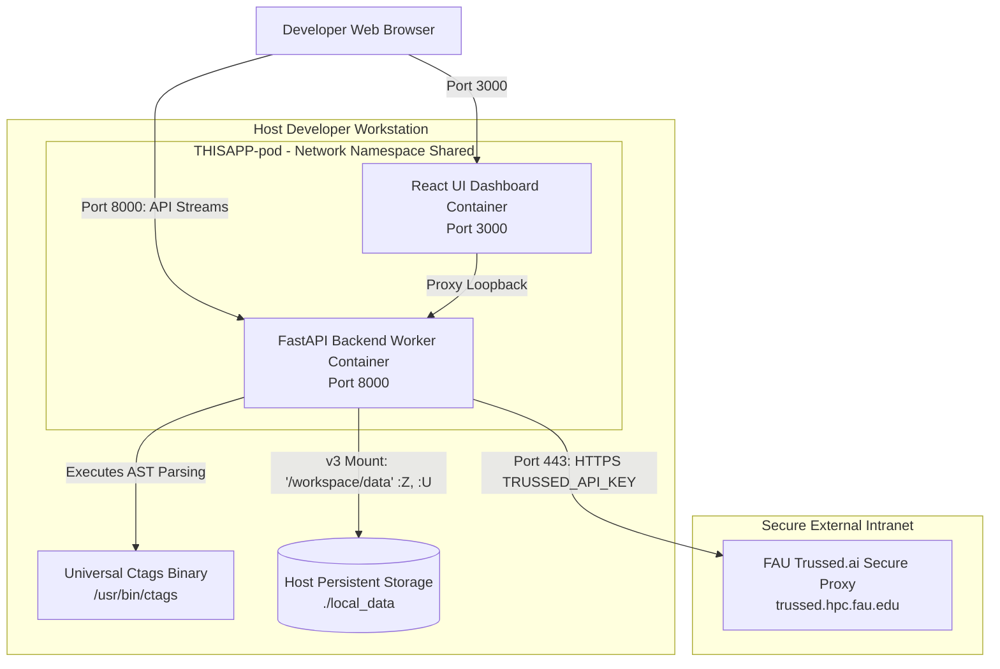
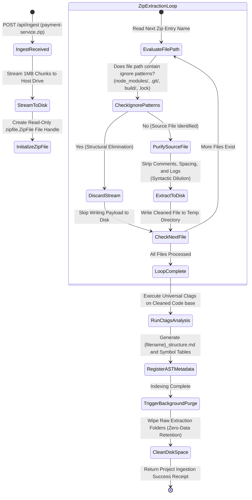
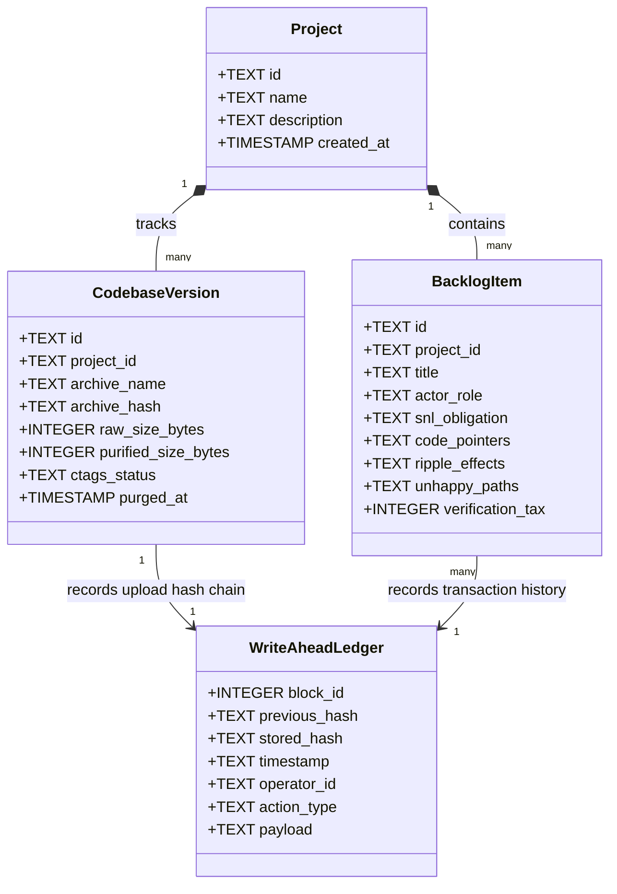

# System Modeling Specification (v3)

This document provides fully compiled, standardized **Mermaid.js diagram definitions** that map the core operational workflows and database topologies direct ZIP-ingestion architecture.

---

## 1. Workstation Container Pod Topology (Deployment View)

This blueprint maps the network and filesystem isolation boundaries of the local, rootless **Podman container pod** (`THISAPP-pod`), highlighting secure loopback ports and mounted host storage boundaries.



---

## 2. Ingestion & On-The-Fly Noise Purging (Activity Flow)

This diagram details the step-by-step unzipping execution, illustrating how the background worker filters non-functional folders to optimize local storage boundaries and data leakage risks.



---

## 3. End-to-End Interaction Sequence Diagram

This trace maps the sequential interaction path of a requirement validation cycle, showing how local SQLite chains coordinate with offloaded FAU proxy caches.

```mermaid
sequenceDiagram
    autonumber
    actor Developer as Workstation Developer
    participant UI as React UI Dashboard
    participant API as FastAPI Ingestion Backend
    participant DB as Local SQLite (governance.db)
    participant FAU as FAU Trussed.ai Proxy

    %% Code Ingestion Flow
    Developer->>UI: Select pre-packaged ZIP archive (under 50MB)
    UI->>API: Stream ZIP file in chunked POST multipart request
    Note over API: Streams 1MB chunks to disk & filters node_modules on-the-fly
    API->>API: Execute Universal Ctags AST Symbol Indexing
    API->>DB: Write Ingest Log & Recalculate SHA-256 Backward Link Block
    API->>UI: Return Ingestion Complete Receipt

    %% Requirements refinement
    Developer->>UI: Input raw textual requirements draft
    UI->>API: POST /api/refine (raw text)
    API->>API: Execute NLP POS Tokenizer (spacy)
    Note over API: Categorize requirements into Correct, Incorrect, and Missing
    API->>UI: Return categorized RUPPs template obligations console

    %% Prompt enrichment & Caching
    Developer->>UI: Trigger Backlog Sizing & Ticket Generation
    UI->>API: POST /api/generate-tickets
    API->>FAU: Route requests using TRUSSED_API_KEY with Context Cache Active
    Note over FAU: Gemini caches optimized codebase layout; reduces tokens by up to 79%
    FAU-->>API: Return enriched backlog items (Code Pointers, Domino Risks)
    API->>DB: Append transaction block to Ledger & Update Hash Chains
    API-->>UI: Deliver completed backlog cards & tickets
    UI-->>Developer: Display visual task metrics and Gantt Sizing estimates
```

---

## 4. Backlog and Immutably Chained Database (Class Diagram)

This schema displays the entity relationships of the local, zero-configuration SQLite transaction database (`governance.db`).


